# 🐍 Smart Code Editor (AI-Powered IDE)

A full-stack web-based code editor that integrates **Google Gemini AI** to act as a real-time intelligent programming mentor. 

Unlike standard compilers, this tool allows users to not only run code safely but also ask natural language questions about their logic, errors, or syntax directly within the interface.

## 🚀 Features (Version 1.0)

* **Interactive Code Editor:** Syntax highlighting, line numbers, and auto-indentation (powered by CodeMirror).
* **Safe Code Execution:** Compiles and runs Python code securely using the Piston API.
* **AI Mentor Integration:** Innovative "Ask AI" feature that sends code context + user questions to Google Gemini (v2.5 Flash) for instant explanations.
* **User Authentication:** Secure Sign Up and Login system with password hashing.
* **Feedback System:** Users can submit feedback directly to the database.
* **Modern UI:** Clean, dark-mode interface designed for developer focus.

## 🛠️ Tech Stack

* **Frontend:** HTML5, CSS3, JavaScript, CodeMirror (UI Library)
* **Backend:** Python, Flask, SQLAlchemy (ORM), Flask-Login
* **Database:** SQLite (Serverless relational DB)
* **AI Engine:** Google GenAI SDK (Gemini 2.5 Flash)
* **Compiler Engine:** Piston API (REST via `requests`)

## 🏗️ Project Architecture

The Smart Code Editor follows a **Client-Server** architecture, integrating a local SQLite database for user management with external cloud APIs for heavy computation (AI & Compilation).

```mermaid
graph TD
    User[👤 User] -->|Interacts| Client[💻 Frontend Client<br>HTML / JS / CodeMirror]
    
    subgraph "Application Server"
        Client <-->|HTTP JSON Requests| Flask[🐍 Flask Backend<br>app.py]
        Flask <-->|SQLAlchemy ORM| DB[(🗄️ SQLite Database<br>info.db)]
    end
    
    subgraph "External Cloud Services"
        Flask <-->|Execute Code| Piston[⚙️ Piston API<br>emkc.org]
        Flask <-->|AI Prompts| Gemini[🤖 Google Gemini API<br>Generative AI]
    end

    %% Flow Styling
    linkStyle 0 stroke:#2ecd71,stroke-width:2px;
    linkStyle 1 stroke:#2ecd71,stroke-width:2px;
```


## 🔄 Data Flow

* **Authentication:** User credentials are sent to Flask, hashed securely using werkzeug.security, and stored in the SQLite database.
* **Code Execution:** When a user runs code, the backend sends the source code to the Piston API, which executes it in a secure sandboxed environment and returns the output.
* **AI Assistance:** When a user asks a question, the backend constructs a prompt containing the specific code context and sends it to Google Gemini. The AI response is parsed and displayed in markdown format.


## 📂 Project Structure

```text
flask_code_editor/
├── .env                  # API Keys (Not tracked by Git)
├── requirements.txt      # Python dependencies
├── app.py                # Main Flask backend application
├── info.db               # SQLite Database (Auto-generated)
└── templates/
    └── index.html        # Frontend UI
└── static/
    ├── script.js         # Client-side logic (Fetch API, UI events)
    └── style.css         # Dracula theme styling
 
```

